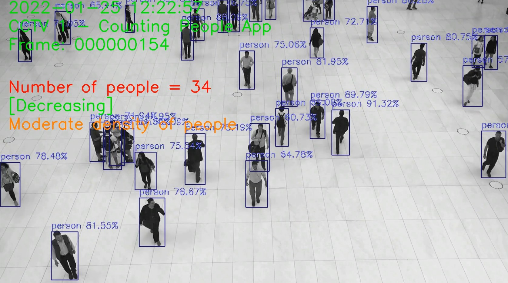

# Crowd Counting

**People counting**, also known as **crowd counting**, is a common application of computer vision (CV). People counting is used to count people passing by or to estimate the number of people in an area.
Statistics of people counted can be produced to provide insights.

There are many ways to do it. In this python notebook we will use a predefined **RetinaNet model that can detect up to 80 standard objects**. 
Results will be saved into an **Azure ML experiment**.

26-Jan-2022
 
Serge Retkowsky | serge.retkowsky@microsoft.com | https://www.linkedin.com/in/serger/
